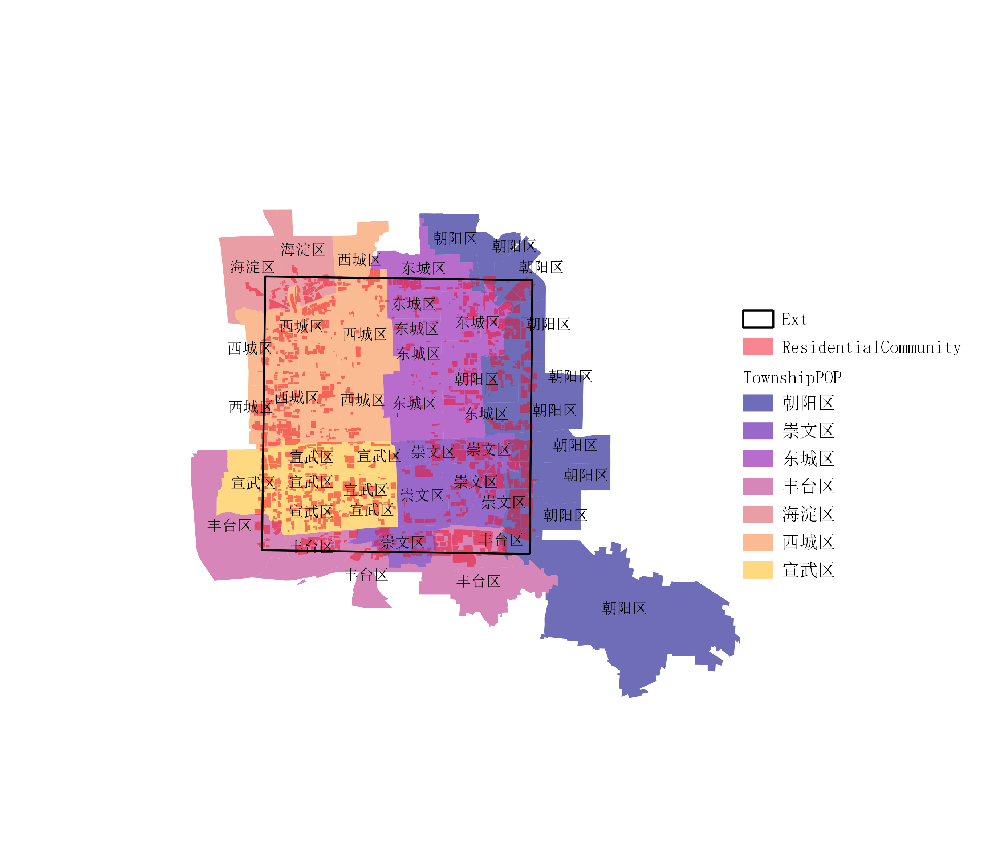
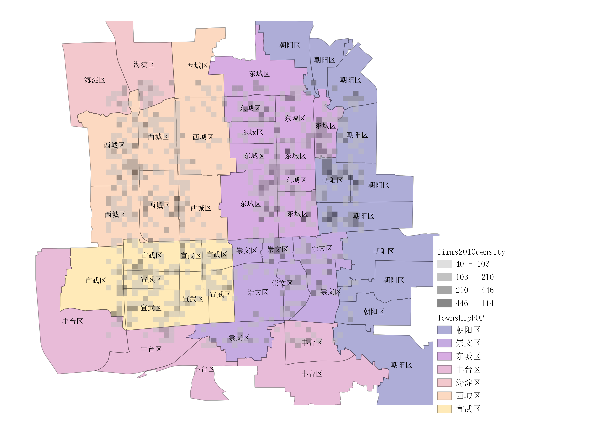
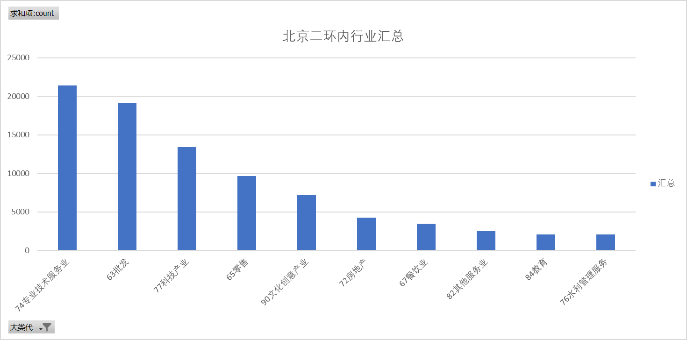
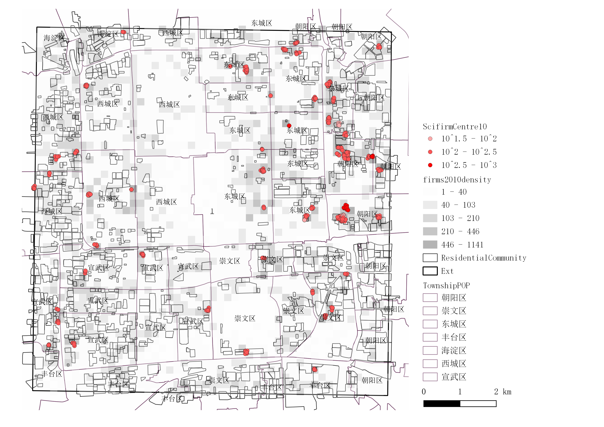
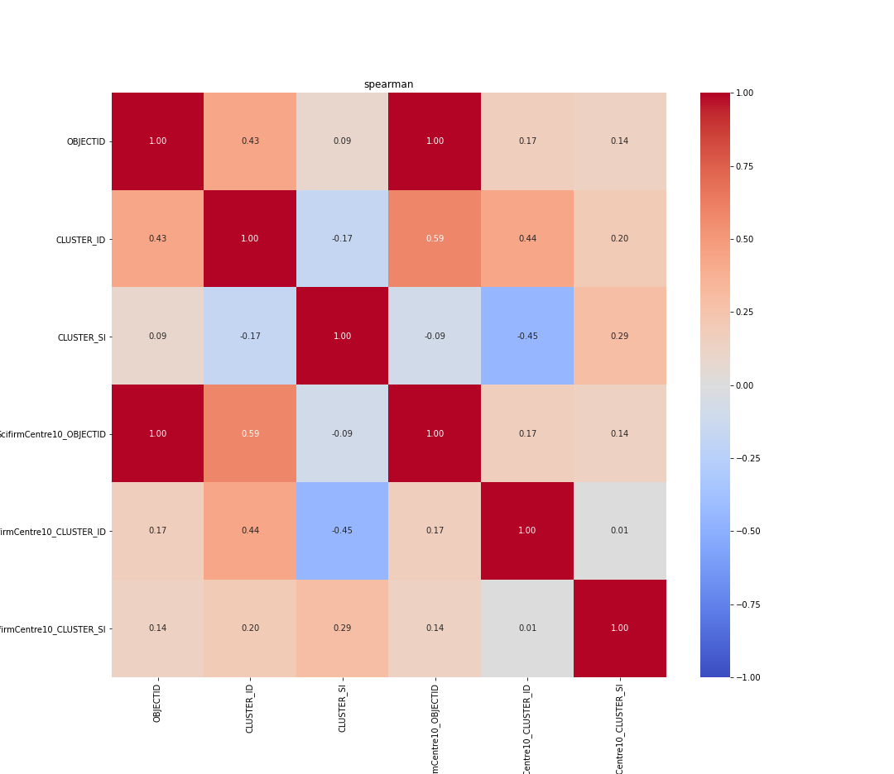
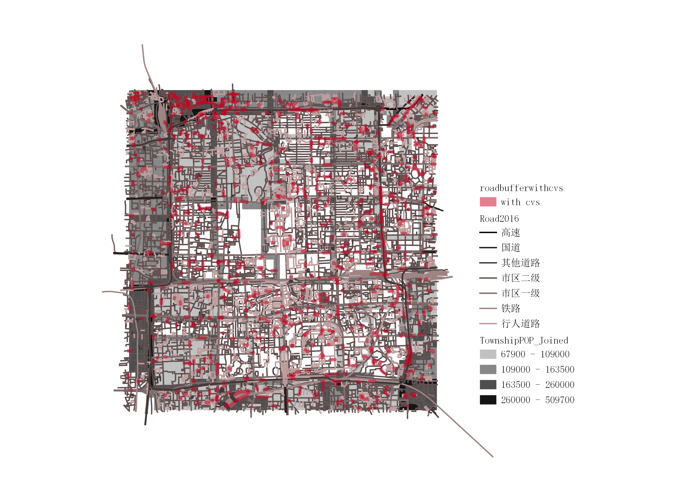
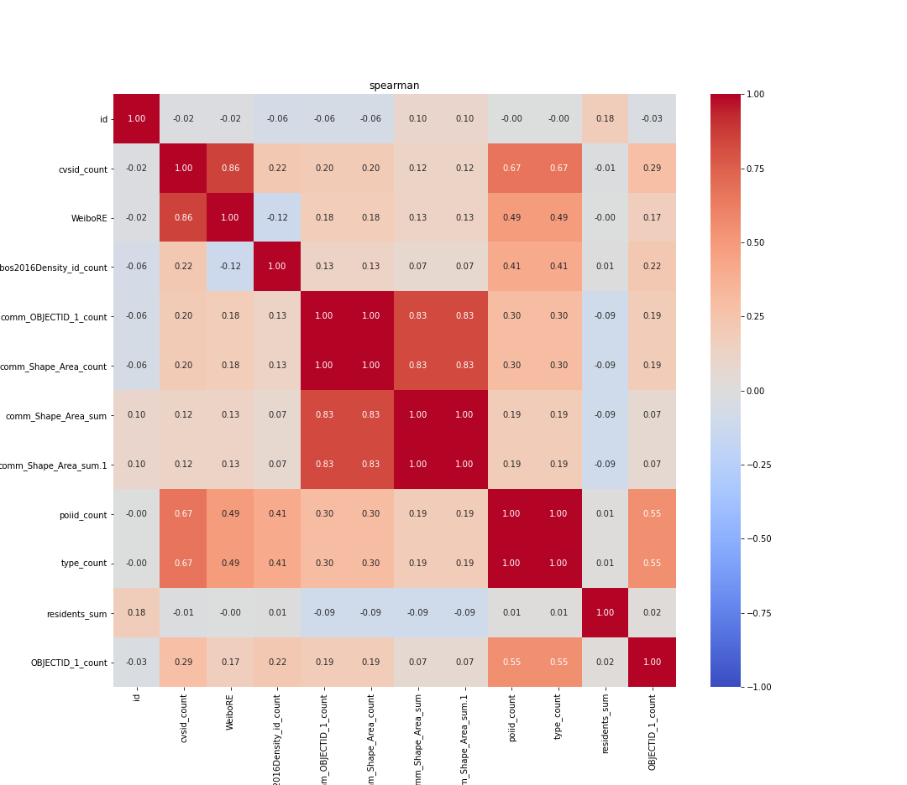
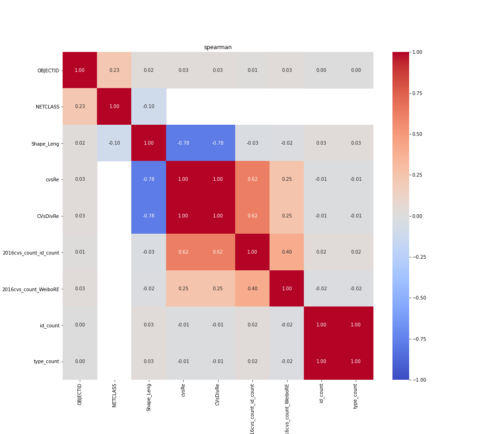

# 基于POI及微博用户特征的北京市二环内便利商店集中区域城市人口面貌分析方法探索

*本论文为清华大学"大数据与城市规划"课程作业，展示定量城市研究的分析方法与应用。*

---
## 一、	研究背景
便利商店是城市居住者自发创办的特殊公共服务设施，这种服务设施除了满足社区居民的日常采购需求外，也为深夜归家的职工提供了满足餐饮需求的场所。受龙瀛，郎嵬老师借助大数据与大模型对中国人居环境进行多维度解读的启发（龙瀛，郎嵬，2016），本文基于2014,2016及2021三年的POI数据，尝试通过研究北京二环内24小时便利店的空间布局变化，以及对应社区及办公场所的分布，研究其主要目标人群特征 (图1)。本文中便利店目标人群，受众年龄以及核心数据相关分析参考网络公布的便利店行业调查报告。

| 阶段 | 主要内容 | 具体方法/数据 |
|------|----------|---------------|
| **前期准备** | 提出问题 | 明确研究目标 |
|  | 文献综述 | 参考相关研究 |
|  | 明确研究方法 | 确定技术路线 |
| **数据获取** | 分享数据 | 公共交通站点、小区信息、POI数据等 |
|  | 公开数据 | 行业报告、微博用户数据 |
| **数据分析** | 空间分布特征 | 核密度分析、DBSCAN聚类 |
|  | 相关性分析 | 斯皮尔曼相关分析 |
|  | 回归建模 | 多元线性回归 |
| **得出结论** | 人口画像推测 | 识别主要消费群体特征 |

## 二、	数据采集与分析
### （一）数据类型
研究数据主要来自课程提供的北京二环内城市空间新数据，包括street＿harvey, street＿walkscore等街道形态数据, Bus Station2014, Junction2014, Subway Stations等交通点位数据，,TownPOP人口密度数据，Firm2010办公场所点位数据，以及POI2014，和POI2016等活动点位数据。鉴于本文关注24小时便利店,而大众点评上相关标签下数据有限，因此仅百度API数据大类为便利店的POI数据作为补充。最终所获得的2021年便利店POI数据共计157条，其中研究区域内有效信息78条，可确认商店种类为便利店的数据共33条。二环内街道数据共计27061条,其中有760条街道的55米缓冲区范围内存在便利店POI。与2016年的4863条POI数据与2014年313条数据相比，获取数据范围与数量有限，代表性不足；因此本研究以2016和2014年POI数据为主，2021年数据仅用于地理位置分布上的补充作用。本文主要通过200*200m网格对点位数据进行分析，DSCAN聚类以明确点位聚集分布，并通过斯皮尔曼相关系数及多元线性回归进行相关性比较。
### （二）数据范围
本研究针对北京二环附近小区内及周围便利店分布情况，涉及以西城、东城、宣武、崇文为主的7个区（图2）。为了进一步明确现有便利店POI点位数据与周边区域用户群体的直接的对应关系，对北京二环内就业及社区信息进行了分析以识别出主要就业和居住中心。
<!-- 图2：研究范围 -->

### （三）就业及居民中心识别
北京二环内的企业机构主要集中在西城区，东城区，宣武区和朝阳区(图3)。
<!-- 图3：区域内产业密度分布及所属城区 -->

从所处功能区来看，分布在西城区和东城区的就业中心以商务金融为主，宣武区靠近紫禁城附近产业以文化创意为主（图4）。
<!-- 图4：各功能区对应产业分布 -->

从行业类型来看，北京二环内产业数量前十位以专业技术服务业,科技产业和批发零售类企业为主（图5）。
<!-- 图5：各类企业分布情况 -->

其中值得注意的是，北京二环内的各产业类型分布方式中，专业技术服务业（74），科技类企业（77）和文创业（90）的分布表现出较为明显的中心区域；以批发（63），零售（65），餐饮业（68）为代表的商业和服务类产业则广泛分布在各个区域，与所处区域人口联系较大。
<!-- 图6：北京二环内各行业企业数量汇总 -->

在前十位产业中，科创类产业（74，77，76，90）在北京二环内的分布有聚集性高，密度大的特点具有明显的分布特征，且职员年龄层次与学历特征较为统一，其职员办公地点较为固定，通常为公司职员、以高校本科及以上学历为主，适合用于表现就业中心分布 。通过对10firm中密度前十类数据进行处理，剔除不具有明显聚集性，分布较为广泛平均的批发，零售，餐饮与房地产数据，以100个为最小聚类数量，200米（即网格单位）为最大间距，获取主要就业中心（图7）；其中以东二环和朝阳门外大街沿线的就业中心与周围居民区的重叠性较高，主要为东直门街道，呼家楼街道，建外街道和朝外街道办事处管辖区域；其余聚类呈零散分布，从单位聚类数量程度上来说明显低于以上就业中心。
<!-- 图7：二环内主要就业中心 -->

### （四）就业中心及社区人口密度和便利店的重合度
居住中心数据基于townshipPOP所代表城市常住人口密度分布，以及根据weibo2016获取年轻白领居住分布 （图８）。 2016年微博用户中，大学以上高等学历用户占比高达77.8%，18-30岁用户占比接近70%，用户呈现年轻白领化（微博数据中心，2016）。
<!-- 图８：常住人口分布，社区年轻职工密度及就业中心分布对比 -->

以最小聚类为5，最大点距为50m对便利店数据进行处理，便利店聚类分布与科创企业聚类相关性中等（0.29）。通过对便利店聚类设置50m缓冲区，可见高密度便利店聚类基本覆盖就业中心（图9），同时与社区人口分布也表现出较明显关联，以人口密度较高的丰台区和西城区便利店聚类为显著（图10）（1.b)。
<!-- 图９：便利店辐射区域与就业中心的关系-->

<!-- 图10：便利店缓冲区与常住人口分布 -->

<!-- 图1.a：cvsFirmRECorr_spearman -->

便利店分布与社区人口密度相关性较弱（0.164636），与社区内路网布局相关性较高，以内部行人道路较为丰富的社区内便利店分布较为密集，这些社区的人口密度也相对较低；临高速、国道和其他道路建设的高密度社区内便利店分布较少（图11）。
<!-- 图11：沿街便利店缓冲区与人口密度关系 -->

POI总体分布与微博用户分布之间的相关性中等偏高（0.41），即与18-30岁年轻白领居住分布相关性较高，这与POI总量和类别相关(1.a)。
<!-- 图1.b：cvsREweiboCorr_spearman.png -->

### （五）便利店分布与街道关系
经过数据清洗，2014至2016年的便利店数量增长14倍，便利商店种类除24小时便利店和超市以外，增加了便利食品店，其中食品店主要分布在什刹海，与其余便利店及超市的均匀分布不同。从街道分布来看，新的便利商店分布以2014年已有店铺为中心沿路网扩散，然而便利店分布与街道长度相关性极低（0.03），故排除在主要因素之外；在以便利店密度为联系的情况下，道路平均便利店密度与年轻白领人群密度产生弱相关（0.25）（1.c)。
<!-- 图1.c：RoadWeiboRECorr_spearman.png -->

### （六）多重线性回归
通过上述分析可知便利店密度与就业中心密度，社区面积，社区居民密度，以及年轻白领人群分布4个影响因素的线性相关较低或不存在共线性，可进行多元线性回归。
回归公式：CVSdensity＝β＋β1 (CommAreaDensity)+β2 (ResidentsDensity)+β3 (Weibos2016Density)＋β4 (RoadLength)+β5 (FirmDensity)
去除无相关性的街道网格长度因素之后，通过sckit-learn进行回归计算，结果如右表。白领人群分布密度（0.15）和就业场所分布密度（0.19）的关联性较高，与社区面积和居民数量关联度较弱。
| Regression variables | reg_coe |
|---------------------|---------|
| comm_Shape_Area_sum | 0.03114056 |
| residents_sum | 0.0087997 |
| Weibos2016Density_id_count | 0.14849998 |
| ScifirmDens_count | 0.19367197 |
## 三、	结论
从分布区域来看，便利店分布较为分散，遍布各个街区的街道路口；形成了方庄，右安门，天桥及大栅栏区域，金融街及西长安街区域，东华门及朝阳门区域，安定门区域，东直门及北新桥地区和朝外街道8个密度较高的分布区，前三个区域社区密度较高，其中方庄和右安门位于丰台区，为主要北漂年轻职工居住区域；后四个区域为办公场所较为密集的就业中心，该现象说明年轻公司职工与24小时便利店主要消费群体吻合，为该地区主要工作和居住人群。从相关性分析和多重线性回归分析来看，研究区域内影响便利店分布的主要因素为居住年轻白领人口密度和就业场所分布密度，综上与行业报告中年轻公司职工为主要消费人群（观研报告网，2018），社区中年轻家庭，年轻工作人群为24h便利店主要消费者的用户特征对应（毕马威中国，2021）；由此可见，该分析方法可以有效借助大数据描绘特定人群特征。
受限于可获得数据类型，本研究仅对便利店分布与特定年龄段人群分布的相关性进行了粗略探索，未能考虑便利店分布与公共交通站点之间的关系，以及办公职员的远距离通勤需求，若获得上述数据可解释便利店分布与路网结构的关系；若能获得下班高峰，饭点时间及夜宵时间段北京二环内即时人口分布数据与街景图像信息，可以更好的刻画不同区域便利店用户人群面貌，尤其是细分便利店分类中菜场超市，食品店与便民商店类型的主要消费用户群体，这些因素都将更好的解释北京二环内除18-30岁年轻职工以外人群的便利店偏好类型。
(2853字)

## 四、	参考文献
1. 陈晓东.基于街道尺度的北京二环内餐饮业活力及影响因素分析[J].北京规划建设,2020(01):11-16.
2. 高靖智. 基于居民行为的社区商业空间活力研究[D].沈阳建筑大学,2020.
3. 龙瀛, & 郎嵬. (2016). 新数据环境下的中国人居环境研究 [J]. 城市与区域规划研究, 8 (1), 10-32.
4. 龙瀛 , 刘伦 . 新数据环境下定量城市研究的四个变革[J]. 国际城市规划, 2017, 32(1):64-73.
5. Long, Y. (2016). Redefining Chinese city system with emerging new data. Applied Geography, 75, 36-48.
6. 田颖.北京老城区居住区经济活力布局及影响因素解析[J].北京规划建设,2020(01):36-40.
7. 张学波,宋金平,陈丽娟,孙峰华.北京都市区就业空间分异与职住空间错位行业识别[J].人文地理,2019,34(03):83-90.
8. 朱华星. 广州24小时便利店的空间布局与社区安全相关性研究[D].广州大学,2017.
9. 朱力,李小玲,王璐,杨成忠,谢芬芬.基于DBSCAN聚类的西部城区服务业空间布局特征研究------以西宁市城西区为例[J].湖北农业科学,2021,60(07):166-174+180.
10. 毕马威中国.2021年中国便利店发展报告,2021. https://home.kpmg/cn/zh/home/insights/2021/05/china-convenience-store-development-report-2021.html
11. 观研报告网.2018年中国便利店行业消费人群分析及相关政策汇总（图）.2018. http://free.chinabaogao.com/lingshou/201802/02113206402018.html
12. 微博数据中心，《2016微博用户发展报告》，2016.https://data.weibo.com/report/reportDetail?id=346

---

## 🛠️ 技术方法摘要

| 方法类别 | 具体技术 | 工具实现 |
|---------|----------|----------|
| **空间分析** | 核密度估计、DBSCAN聚类、缓冲区分析 | QGIS, Python |
| **统计分析** | 斯皮尔曼相关、多元线性回归 | Scikit-learn, Pandas |
| **数据来源** | POI数据、微博用户数据、人口统计数据 | 百度API、微博数据中心 |

## 📊 核心发现

- **便利店分布与年轻白领密度相关性**: `r = 0.41`
- **便利店分布与就业中心密度相关性**: `r = 0.29`  
- **便利店分布与总人口密度相关性**: `r = 0.16`
- **识别出8个高密度便利店分布区域**

## 🎓 课程信息

**课程名称**: 大数据与城市规划  
**授课教师**: 龙瀛 教授  
**开课院校**: 清华大学  
**完成时间**: 2021年7月  

---

*本文仅代表课程作业研究成果，用于学术展示目的。*
